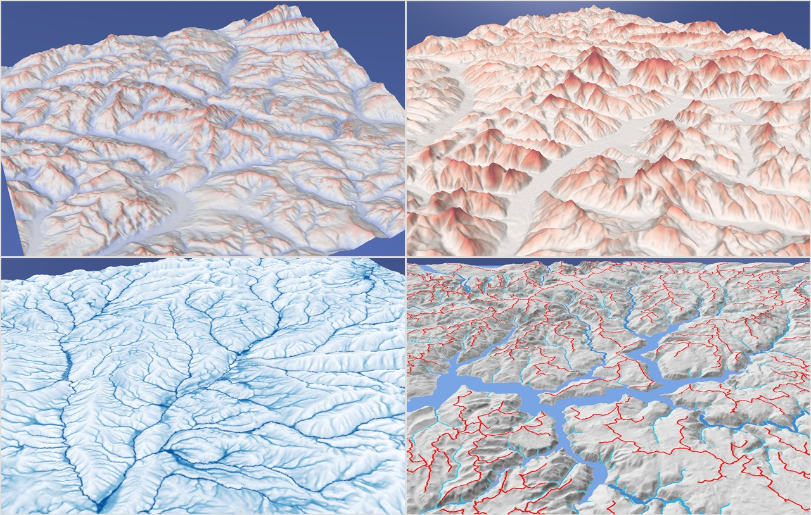

# Terrain Descriptors for Landscape Synthesis, Analysis and Simulation


 **Terrain Descriptors for Landscape Synthesis, Analysis and Simulation**.
 *Oscar Argudo, Eric Guérin, Hugo Schott, Eric Galin*.
 Eurographics 2025 State of the Art.
 Authors' implementation.
 
*Abstract*: Synthetic landscape generation is an active research area within Computer Graphics. Algorithms for terrain synthesis and ecosystem simulations often rely on simple descriptors such as slope, light accessibility, and drainage area. Typically, the results are assessed from a perceptual standpoint, focusing primarily on visual plausibility. Other fields, such as Geomorphology and Earth Sciences, have already proposed several analytical descriptors to measure various terrain properties. This work aims to bridge the gap between these disciplines and Computer Graphics. We provide a comprehensive review of commonly used terrain metrics that may be relevant for landscape synthesis, analysis, or simulations. Additionally, we compare the approaches used in Computer Graphics to see if these metrics, or similar ones, have already been introduced. Moreover, we report feedback from a preliminary study conducted with a group of artists to evaluate the potential applications of previously unused metrics. By implementing all these metrics, we enable performance comparisons. Together with the provided correlation matrix, this helps identify instances where a simpler and faster metric can serve as a proxy for a more computationally intensive one.


## Description

The goal of this project is to serve as baseline implementation of the different descriptors included in the survey. 
This is the application code we used for testing, image generation and timings.

Most of the metrics are defined in the [HeightField](./appMetrics/heightfield.h) class. Their implementations are split across a few .cpp files (heightfield-metrics-XXXX.cpp), roughly organized according to the sections of the survey. River and ridge networks, along with a metrics that use them, are implemented in the helper class [TerrainAnalysis](./appMetrics/terrainanalysis.h). Example usages of the metrics from the UI parameters can be found in [mainwindow-draw-metrics.cpp](./appMetrics/mainwindow-draw-metrics.cpp).

The terrain used in most of the figures of the paper is [Alps: Mont Blanc](./terrains/alps-montblanc.png), derived from SRTM-3 data. The default values of the various UI widgets have been set accordingly. You can load one of the preset terrains or import your own, either in PNG or ASCII grid format. After loading, you can scale the terrain to match the desired resolution, spatial extent or elevation range. Other modifier buttons include filling or breaching the terrain to enforce a consistent drainage network, and Gaussian smoothing, implemented for testing purposes.

Some metrics (such as visibility) can take a long time to compute and the application might appear unresponsive during this time, as all code runs on the UI thread. For this reason, some input fields have callbacks that update the terrain metric texture dynamically, while others require reselecting the metric name to manually trigger the update. 

Note that we often prioritized simple and illustrative implementations that closely follow the metric definitions. In some cases, algorithmic optimizations can lead to significant speed-ups (see, for example, the example code using Summed Area Tables for TPI). Additionally, many metrics could be parallelized or implemented on the GPU. This is left as an exercise for the reader :)


### Compiling and running the code

We provide a Qt project file to build the application. It has been tested on a Windows 11 system using Qt 6.3 (MinGW 11.2 and MSVC2019 compilers) and Qt 6.8 (MinGW 13.1 and MSVC2022 compilers) within Qt Creator. 

Please make sure to move or link the [terrains](./terrains) folder to the same directory as the executable or, if you are running it from an IDE, set up the working directory accordingly. 

We included a varied set of [sample terrains](https://github.com/oargudo/terrain-descriptors/releases/download/v1.0/terrains.zip), which can be edited through [presets.txt](./terrains/presets.txt). Most of them are based on SRTM data (~90m/cell resolution) and highlight different terrain types and features. Additionally, there are a few high-resolution DEMs (up to 2m/cell) for testing metrics on finer details, as well as some low-resolution, full-range terrains that are useful for analyzing large surface networks.

You can also download the compiled [binaries for Windows](https://github.com/oargudo/terrain-descriptors/releases/download/v1.0/app-metrics.zip), see the [release](https://github.com/oargudo/terrain-descriptors/releases/tag/v1.0). 


### Improvements

Possible ideas to improve the current application and code:
- Move computations to a separate thread to prevent blocking the UI.
- Display a progress bar during lengthy computations.
- Implement parallelizable metrics on the GPU.
- Define a Metric interface to separate them from HeightField class.
- Better colormap editing (e.g., using a histogram).


### Acknowledgements

- The code for computing prominence and isolation has been slightly adapted from [Andrew Kirmse's repository](https://github.com/akirmse/mountains).
- Most of the terrains provided as exemplars use the [improved SRTM DEMs by Jonathan de Ferranti](https://viewfinderpanoramas.org/dem3.html).
- High-resolution terrains have been downloaded from [ICGC](https://www.icgc.cat/en), [CNIG](https://centrodedescargas.cnig.es/CentroDescargas/home), [swissALTI3D](https://www.swisstopo.admin.ch/en/height-model-swissalti3d) and [USGS NED](https://www.usgs.gov/publications/national-elevation-dataset).
- The Moon terrain is a crop from the [LRO LOLA DEM](https://astrogeology.usgs.gov/search/map/moon_lro_lola_dem_118m) published by USGS Astrogeology Science Center.


## Windows binaries

For convenience, if you just want to test the application, we provide Windows binaries.
You can download them from this [release](https://github.com/oargudo/terrain-descriptors/releases/tag/v1.0).


## Article

The survey is published in [Computer Graphics Forum](https://onlinelibrary.wiley.com/doi/10.1111/cgf.70080) journal.

If you use this code, please cite the paper:
```
@article{Argudo2025descriptors,
    title = {Terrain descriptors for landscape synthesis, analysis and simulation},
    author = {Argudo, O. and Gu{\'e}rin, E. and Schott, H. and Galin, E.},
    journal = {Computer Graphics Forum},
    year = {2025},
    volume = {n/a},
    number = {n/a}, 
    doi = {https://doi.org/10.1111/cgf.70080},
}
```
